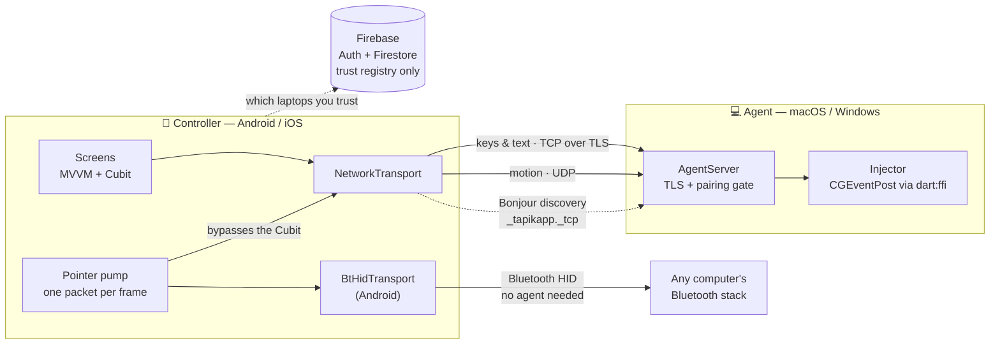

# Tapikapp

**Your phone becomes your laptop's trackpad and keyboard.** Point, tap, scroll and type from across the room — for presentations, a laptop plugged into a TV, or working from the couch. Pair a laptop once, sign in on any phone, and it is already there.

*Tapik* is Tagalog for a light tap.

One Flutter codebase, four targets, two roles: on a phone it runs the **controller**; on a desktop it runs the **agent** that turns packets into real pointer and keyboard events.

---

## How it works



- **Discovery** — the agent advertises `_tapikapp._tcp` over Bonjour; the phone lists laptops by name.
- **Motion over UDP, keys over TCP.** A dropped pointer update is invisible because the next one is 8 ms away. A dropped or reordered keystroke is a bug you can see.
- **Binary packets, not JSON** — about 120 pointer updates a second; each packet is a type byte plus a few bytes of payload.
- **The pointer path never touches the state manager.** Deltas are accumulated in plain fields and flushed once per frame straight to the transport. Routing 120 updates a second through a Cubit would rebuild the UI 120 times a second.
- **Firebase is phone-only.** The agent has no cloud dependency at all. Trust is established *locally*, by typing a code shown on the laptop; the cloud only remembers that decision so a second phone inherits it.

## Measured latency

Plan budget: **under 25 ms finger-to-cursor**. Measured on loopback with `tool/latency_scratch.dart`, which isolates what the app itself costs:

| Leg | Budget | Measured |
|---|---|---|
| Encode a packet | < 1 ms | **0.1 µs** |
| Phone → laptop, motion over UDP | — | **p50 0.045 ms · p95 0.076 ms** |
| Phone → laptop, key over TCP | — | **p50 0.201 ms · p95 0.595 ms** |
| Touch → gesture callback | ~8 ms | one frame, not measured |
| Wi-Fi hop, same access point | 3–10 ms | not measured on loopback |
| Cursor repaint by the OS | ~8 ms | not measured |

The app's own cost is about **0.2 ms of a 25 ms budget** — the rest belongs to the display, the radio and the OS. Motion over UDP arrives roughly **4.5× faster** than keys over TCP at p50, which is the reason the protocol splits them.

## Security

The app transmits every keystroke, including passwords. Without protection it would be a keylogger readable by anyone on the same Wi-Fi.

| | |
|---|---|
| ✅ **Encrypted** | Keys and text travel over TLS. The agent generates a self-signed certificate on first run. |
| ✅ **Physical presence** | An unknown phone must type a 6-digit code shown on the laptop's screen. Bonjour advertising is discovery, not consent. |
| ✅ **Pinned** | After the first pairing the phone remembers the laptop's certificate and refuses any other. A laptop that lets a phone in *without* asking for a code is refused too. |
| ✅ **Rate-limited** | Wrong codes back off per phone, so one stranger cannot lock out the owner. |
| ✅ **Nothing left held** | A ping each way detects a dead link within 8 s, and the laptop releases every held key and button. |
| ✅ **Account-scoped** | Firestore rules confine each user to `users/{uid}/**`. |
| ⚠️ **Motion is not encrypted** | Pointer movement over UDP is unencrypted and authorised by the paired phone's address. Keys and text never travel this way. |
| ⚠️ **Identity is not yet key-bound** | The laptop's identity comes from its advertised name, and the phone identifies itself with a stored id rather than a key it can prove it holds. Binding both to keys is the next piece of work. |

**Out of scope, deliberately:** any path that accepts input from outside the local network. No relay, no port forwarding. The cloud stores trust decisions, never input.

## Platform support

| Phone | Laptop | Path | Status |
|---|---|---|---|
| Android | macOS | Wi-Fi + agent | ✅ built and run |
| iOS | macOS | Wi-Fi + agent | 🟡 built, not yet run on a device |
| Android | any computer | Bluetooth HID | 🟡 built and verified on the encoder; not yet run against a real host |
| Any | Windows | Wi-Fi + agent | ⏳ the agent runs; the Windows injector is not written yet |

**Why iOS cannot be a Bluetooth keyboard:** CoreBluetooth refuses to publish the HID-over-GATT service (UUID `0x1812`); Apple reserves it and no entitlement unlocks it. That is why every iOS remote-mouse app ships a desktop companion, and why the network path is the primary one here.

**Why the Bluetooth path needed no keymap:** the wire format already uses USB HID usage IDs for keys. The macOS injector translates them to virtual keys; the Bluetooth transport passes them straight through.

## Project layout

```
tapikappflutter/lib/
├── core/       protocol (packets, codec, keycodes), router, theme
├── data/       models, repositories, Firebase sources — the Model layer
├── features/   screens (view/) and Cubits (view_model/) — one per feature
└── services/   transport, discovery, server, injector, security — no UI
```

**MVVM + Cubit.** Repositories map every Firebase exception to a sealed `Failure`; widgets never import from `data/`. MVVM fits the screens; it does not fit the input pipeline, which bypasses it on purpose.

## Running it

Requires Flutter 3.47 (Dart 3.13).

```bash
cd tapikappflutter
flutter pub get
flutter run -d macos      # the agent
flutter run -d <phone>    # the controller
```

On macOS the agent needs **Accessibility** permission (System Settings → Privacy & Security → Accessibility). An unsigned debug build loses it on every rebuild; remove the stale entry with **−** and add the app again — toggling it is not enough.

`tool/` holds development scripts that drive the real protocol, transport and server over loopback — for example `dart run tool/security_scratch.dart`.

## Releasing

**Android** — create an upload key once and keep it backed up; losing it means you cannot update the app.

```bash
keytool -genkey -v -keystore ~/tapikapp-upload.jks -keyalg RSA -keysize 2048 -validity 10000 -alias upload
```

Then create `tapikappflutter/android/key.properties` (already git-ignored):

```properties
storePassword=<your store password>
keyPassword=<your key password>
keyAlias=upload
storeFile=/Users/<you>/tapikapp-upload.jks
```

`flutter build appbundle` refuses to build without it, so a debug-signed bundle can never reach Play by accident. `flutter build apk --release` still works without it, for local testing.

**macOS** — distribute outside the Mac App Store: a sandboxed app cannot be granted Accessibility, so it could not move the cursor.

1. Join the Apple Developer Program and create a **Developer ID Application** certificate.
2. In Xcode → Runner → Signing & Capabilities, choose your team and add **Hardened Runtime** (required for notarization). Leave App Sandbox off.
3. `flutter build macos --release`, then notarize and staple:

```bash
xcrun notarytool submit Tapikapp.zip --keychain-profile <profile> --wait
xcrun stapler staple Tapikapp.app
```

**iOS** — needs the Apple Developer Program; archive in Xcode and upload to TestFlight.

**Windows** — waiting on the Windows injector.
